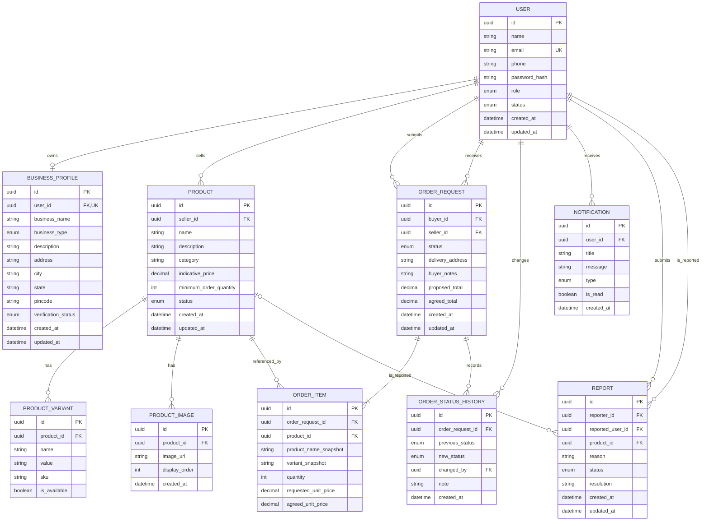

# MarketSphere — Entity Relationship Diagram

## 1. Overview

The MarketSphere ER Diagram describes the relational database structure for the initial B2B marketplace.

The database is designed to support seller onboarding, buyer registration, product catalog management, order requests, notifications, and administration.

PostgreSQL is the proposed relational database, with Prisma as the ORM.

## 2. ER Diagram

## 3. Entity Descriptions

| Entity               | Description                                                 |
| -------------------- | ----------------------------------------------------------- |
| USER                 | Stores user account details, role, and account status       |
| BUSINESS_PROFILE     | Stores business information associated with a user          |
| PRODUCT              | Stores product listings created by sellers                  |
| PRODUCT_VARIANT      | Stores product options such as size or color                |
| PRODUCT_IMAGE        | Stores references to product images                         |
| ORDER_REQUEST        | Stores the buyer's request and its current status           |
| ORDER_ITEM           | Stores products and quantities included in a request        |
| ORDER_STATUS_HISTORY | Records status changes and the user who made them           |
| NOTIFICATION         | Stores notifications for users                              |
| REPORT               | Stores reports submitted by users for administrative review |

## 4. Relationships

### User and Business Profile

One user can have zero or one business profile.

A business profile belongs to exactly one user.

The one-to-one relationship is enforced through a unique user_id foreign key.

### User and Product

A seller can create multiple products.

Each product belongs to one seller.

The seller_id foreign key references USER.id. The application must validate that the referenced user has the seller role and an active account.

### Product and Product Variant

A product can have zero or more variants.

Each variant belongs to exactly one product.

Variants can represent product-specific options such as size, color, or fabric.

### Product and Product Image

A product can have multiple images.

Each image belongs to exactly one product.

The database stores image references, while the actual image files are stored in object storage.

### Buyer and Order Request

A buyer can submit multiple order requests.

Each order request belongs to one buyer.

### Seller and Order Request

A seller can receive multiple order requests.

Each order request belongs to one seller.

The initial MVP should use one seller per request. A multi-seller basket can be considered later.

### Order Request and Order Item

Each order request contains one or more items.

Each item belongs to exactly one request.

An item references a product but also preserves relevant product details as snapshots so that historical order information remains consistent.

### Order Request and Order Status History

An order request can have multiple status history records.

Each status history record belongs to one request and records the user responsible for the change.

### User and Notification

A user can receive multiple notifications.

Each notification belongs to one user.

### User and Report

A user can submit multiple reports and may also be the subject of multiple reports.

A report may refer to a product when the complaint concerns a listing.

## 5. Database Constraints

The following constraints should be implemented:

* User email addresses must be unique.
* Each business profile must reference a valid user.
* Each product must reference an eligible seller.
* Each product variant must reference an existing product.
* Each product image must reference an existing product.
* Each order request must reference a valid buyer and seller.
* Each order item must reference an existing request and product.
* Quantities must be positive integers.
* Prices and totals must be non-negative.
* Order status transitions must be validated by the backend.
* Historical order item details must be preserved.
* Users must not access another user's private records without authorization.

## 6. Important Implementation Notes

### One seller per order request

The initial database design associates each order request with exactly one seller. If a buyer requests products from multiple sellers, the application should create separate requests for each seller.

This simplifies seller confirmation and order negotiation.

### Product snapshots

Order items should preserve the product name, variant details, requested quantity, and relevant pricing terms.

The application should not depend exclusively on the current product listing to display historical orders.

### Pricing

The system should distinguish between indicative product pricing, requested pricing, and agreed pricing.

The backend must calculate totals using validated item quantities and agreed prices. It must not trust client-submitted totals.

### Status history

Status changes should be written to the status history table whenever the request changes state.

The current status should be stored on ORDER_REQUEST for efficient querying.

### Image storage

Product image files should be stored outside PostgreSQL in an appropriate object storage service. The database should store the file URL or storage key.

### User roles

The initial schema uses a single USER table with a role field. The backend must enforce role-specific permissions.

### Future expansion

Additional entities may be introduced later for:

* Payments
* Shipments
* Reviews
* Inventory
* Business analytics
* Learning resources
* Quality and waste management

These are not required for the initial MVP.
