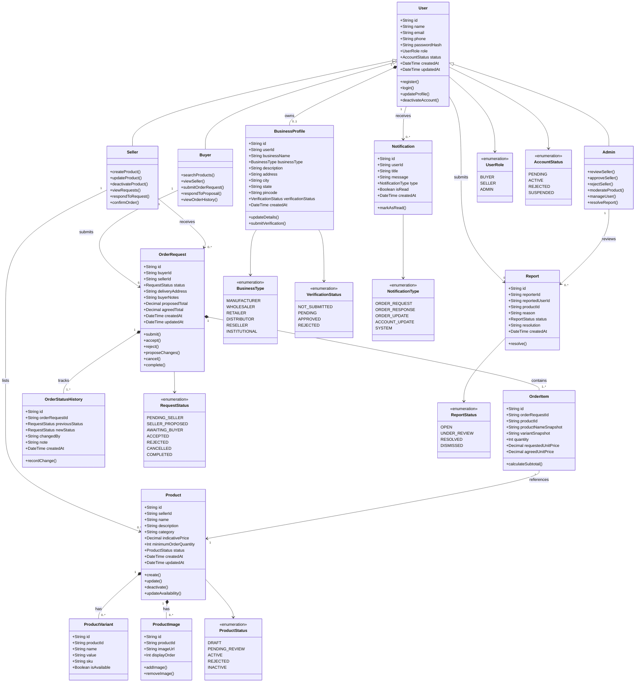

# MarketSphere — UML Class Diagram

## 1. Overview

The UML Class Diagram represents the core object-oriented structure of MarketSphere.

The system supports three primary user roles:

* Buyer
* Seller
* Administrator

The initial marketplace focuses on home textiles and home furnishings, connecting sellers in Sonipat with buyers across Delhi-NCR.

The diagram models the core marketplace domain. Authentication infrastructure, database implementation details, and UI components are intentionally kept separate from the domain classes.

## 2. Class Diagram

## 3. Class Responsibilities

| Class              | Responsibility                                                           |
| ------------------ | ------------------------------------------------------------------------ |
| User               | Stores common account information and authentication-related identity    |
| Buyer              | Supports product discovery and order requests                            |
| Seller             | Manages products and responds to order requests                          |
| Admin              | Manages platform users, verification, moderation, and reports            |
| BusinessProfile    | Stores business information and verification status                      |
| Product            | Represents a seller's product listing                                    |
| ProductVariant     | Represents product options such as size, color, or material              |
| ProductImage       | Stores product image references                                          |
| OrderRequest       | Manages the buyer's request and its negotiation and acceptance lifecycle |
| OrderItem          | Stores requested products and agreed item-level terms                    |
| OrderStatusHistory | Records changes to request and order status                              |
| Notification       | Stores user-facing notifications                                         |
| Report             | Stores complaints or reports for administrative review                   |

## 4. Important Design Decisions

### User roles

Buyer, Seller, and Admin inherit common account attributes from User. Role-specific operations are separated into their respective classes.

In the database, these may be implemented as a single User table with a role field rather than separate tables for each subclass.

### Business profiles

A user may have one business profile. The initial implementation should enforce the intended relationship and ensure that seller-specific verification requirements are applied to seller accounts.

### Product variants

Products can have multiple variants. For example, a bedsheet may be available in different sizes or colors.

Variant attributes should be flexible enough to support different home textile products without requiring a separate class for every product type.

### Order requests

OrderRequest is the central transaction entity.

It begins as a request, not a confirmed order. The seller can accept, reject, or propose changes. If the seller proposes changes, the buyer must respond before the request becomes an accepted order.

### Order snapshots

OrderItem stores product information relevant to the request at the time it is submitted or accepted.

Historical orders must not silently change when a seller edits a product listing.

### Status history

OrderStatusHistory preserves the sequence of changes to an order request. It supports troubleshooting and helps both parties understand what happened.

### Authentication

The User class represents the application account. Actual authentication, password hashing, session handling, and authorization should be implemented in dedicated backend services and middleware.

## 5. Electron Compatibility

The domain classes are independent of the interface used to access MarketSphere.

The same business logic should be usable from:

* The web application
* The future Electron desktop application

Electron should not introduce a second copy of the order, product, or user domain logic.

The desktop application should communicate with the same backend services as the web application, using authenticated and authorized API requests.
