# MarketSphere — Use Case Diagram

## 1. Overview

The MarketSphere Use Case Diagram describes the interactions between the system and its three primary actors:

* Buyer
* Seller
* Administrator

The diagram covers the initial B2B marketplace, including onboarding, product discovery, order requests, seller confirmation, and administrative management.

The web application and future Electron desktop application will provide access to the same core use cases.

## 2. Use Case Diagram

```mermaid
flowchart LR
    Buyer([Buyer])
    Seller([Seller])
    Admin([Administrator])

    subgraph MS["MarketSphere System"]
        direction TB

        UC1([Register])
        UC2([Login])
        UC3([Manage Profile])

        UC4([Browse Products])
        UC5([Search Products])
        UC6([Filter and Sort Products])
        UC7([View Product Details])
        UC8([View Seller Profile])
        UC9([Submit Product Inquiry])

        UC10([Submit Order Request])
        UC11([View Order Requests])
        UC12([Review Order Request])
        UC13([Accept Request])
        UC14([Reject Request])
        UC15([Propose Changes])
        UC16([Respond to Proposal])
        UC17([Track Order Status])
        UC18([Cancel Eligible Request])
        UC19([Coordinate Fulfillment])

        UC20([Manage Product Listings])
        UC21([Upload Product Images])
        UC22([Update Product Availability])

        UC23([View Notifications])
        UC24([Manage Seller Verification])
        UC25([Moderate Products])
        UC26([Manage Users])
        UC27([Review Reports])
        UC28([Monitor Marketplace])
    end

    Buyer --> UC1
    Buyer --> UC2
    Buyer --> UC3
    Buyer --> UC4
    Buyer --> UC5
    Buyer --> UC6
    Buyer --> UC7
    Buyer --> UC8
    Buyer --> UC9
    Buyer --> UC10
    Buyer --> UC11
    Buyer --> UC16
    Buyer --> UC17
    Buyer --> UC18
    Buyer --> UC19
    Buyer --> UC23

    Seller --> UC1
    Seller --> UC2
    Seller --> UC3
    Seller --> UC11
    Seller --> UC12
    Seller --> UC13
    Seller --> UC14
    Seller --> UC15
    Seller --> UC17
    Seller --> UC19
    Seller --> UC20
    Seller --> UC21
    Seller --> UC22
    Seller --> UC23

    Admin --> UC2
    Admin --> UC24
    Admin --> UC25
    Admin --> UC26
    Admin --> UC27
    Admin --> UC28
```

## 3. Actors

### Buyer

A business customer who uses MarketSphere to find products and suppliers and submit order requests.

The buyer can:

* Register and log in.
* Manage a business profile.
* Search and browse products.
* Filter and sort product listings.
* View product and seller details.
* Submit inquiries and order requests.
* Respond to seller proposals.
* Track request and order status.
* Cancel eligible requests.
* Coordinate fulfillment with sellers.
* View notifications.

### Seller

A manufacturer, wholesaler, or supplier who uses MarketSphere to reach business buyers.

The seller can:

* Register and log in.
* Manage a business profile.
* Submit verification information.
* Create and manage product listings.
* Upload product images.
* Update product availability.
* View incoming order requests.
* Review buyer requirements.
* Accept or reject requests.
* Propose changes to order terms.
* Track order status.
* Coordinate fulfillment.
* View notifications.

### Administrator

A platform operator responsible for marketplace governance and moderation.

The administrator can:

* Log in to the admin dashboard.
* Review seller verification submissions.
* Approve or reject seller registrations.
* Moderate product listings.
* Manage user accounts.
* Review user reports.
* Monitor marketplace activity.

## 4. Use Case Descriptions

| Use Case                    | Actor                | Description                                                  |
| --------------------------- | -------------------- | ------------------------------------------------------------ |
| Register                    | Buyer, Seller        | Create a new account                                         |
| Login                       | Buyer, Seller, Admin | Authenticate with the system                                 |
| Manage Profile              | Buyer, Seller        | View and update permitted profile details                    |
| Browse Products             | Buyer                | Explore available products                                   |
| Search Products             | Buyer                | Find products using keywords                                 |
| Filter and Sort Products    | Buyer                | Refine product results                                       |
| View Product Details        | Buyer                | View specifications, pricing information, and seller details |
| View Seller Profile         | Buyer                | Review seller business information                           |
| Submit Product Inquiry      | Buyer                | Ask a seller for product information                         |
| Submit Order Request        | Buyer                | Send a structured purchase request to a seller               |
| View Order Requests         | Buyer, Seller        | View requests relevant to the user's account                 |
| Review Order Request        | Seller               | Inspect requested products and terms                         |
| Accept Request              | Seller               | Confirm the request and its agreed terms                     |
| Reject Request              | Seller               | Decline a request                                            |
| Propose Changes             | Seller               | Suggest changes to quantity, price, or delivery terms        |
| Respond to Proposal         | Buyer                | Accept or decline the seller's proposed changes              |
| Track Order Status          | Buyer, Seller        | View the current request or order status                     |
| Cancel Eligible Request     | Buyer                | Cancel a request when permitted                              |
| Coordinate Fulfillment      | Buyer, Seller        | Coordinate delivery and completion outside the platform      |
| Manage Product Listings     | Seller               | Create, edit, and deactivate products                        |
| Upload Product Images       | Seller               | Add images to product listings                               |
| Update Product Availability | Seller               | Update availability information                              |
| View Notifications          | Buyer, Seller        | View important marketplace updates                           |
| Manage Seller Verification  | Admin                | Review and decide on seller verification                     |
| Moderate Products           | Admin                | Review and manage product listings                           |
| Manage Users                | Admin                | Manage user accounts                                         |
| Review Reports              | Admin                | Investigate user-submitted reports                           |
| Monitor Marketplace         | Admin                | View marketplace activity                                    |

## 5. Important Use Case Rules

### Order Request

The buyer submits an order request containing the requested products, quantities, and delivery requirements.

The request is initially pending seller response.

### Seller Confirmation

The seller reviews the request and may:

* Accept the request.
* Reject the request.
* Propose changes to the requested terms.

### Buyer Response

If the seller proposes changes, the buyer must respond before the request can be accepted under the revised terms.

### Fulfillment

After acceptance, the buyer and seller coordinate payment and delivery outside the MVP.

### Administration

The administrator manages seller verification and product moderation. The administrator does not negotiate commercial terms on behalf of buyers or sellers.

## 6. Web and Electron Access

The use cases are shared across the web and desktop interfaces.

The future Electron application should provide desktop access to the same buyer, seller, and administrator workflows where appropriate.

The Electron application is a delivery platform, not a separate marketplace with different business rules.
