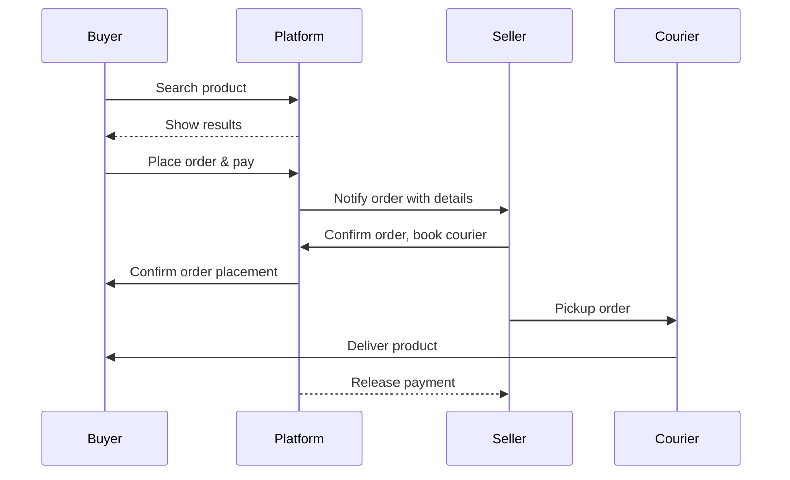

# Executive Summary  
MarketSphere aims to give micro and small enterprises (MSEs) direct access to wider markets via a mobile platform.  Evidence shows digital marketplaces can boost small-business revenues by reducing transaction costs and expanding reach.  However, many MSEs lack digital skills, reliable internet, and payment/logistics support.  The project must prioritize core features (listing/catalogue, search, enquiries, orders, payments) while integrating logistics and trust mechanisms.  Competitors include B2B platforms (IndiaMART, Udaan), network initiatives (ONDC), craft marketplaces (Etsy) and regional e‑tailers (Jumia).  Each uses differing business models: IndiaMART relies on paid premium listings, Udaan on transaction fees and credit services, and Etsy on listing + commission fees.  Key pain points include limited digital literacy, fragmented payments, and high delivery costs.  Feature prioritisation (must-have through low) must align with these challenges (Table 1).  Viable revenue models range from freemium memberships to commissions and logistics fees.  Regulatory and infrastructure contexts vary by region (e.g. India’s ONDC is optional, Africa needs mobile-money integration).  The technical stack (Next.js/Express, TypeScript, Prisma) supports a scalable, cloud-based architecture with offline-capable mobile and Electron desktop clients.  Security (encryption, authentication, PCI compliance) and privacy (data localisation, user consent) are vital.  Onboarding and UI should be ultra-simple with local languages and iconography (low-literacy friendly).  We recommend piloting with a small region, using user interviews and A/B tests to refine onboarding and features.  KPIs include number of onboarded sellers, order volume, active users, and retention.  The MVP should focus on core marketplace and transaction flows, with subsequent phases adding analytics, advanced logistics/payment options, and training resources.  A phased roadmap (Table 5) outlines deliverables by quarter. Risks (market competition, low adoption, tech scaling) are identified (Table 6) with mitigations (e.g. partner with local logistics, strong support/training).  

## Target Users  
**Profile:** Independent micro-entrepreneurs and small business owners (manufacturers, traders, artisans) seeking buyers beyond local markets. Often male/female owners with limited formal education.  Many operate in Tier-2/3 cities or rural areas, in sectors like handicrafts, agro-products, textiles, or component parts.  Typical users juggle production and sales themselves and lack IT training.  

**Devices & Access:**  
- **Smartphones:** Rapid growth: India sold ~164M smartphones in 2025 (billions globally), and mobile internet is dominant.  Studies show MSMEs benefit when owners have smartphone access.  Low-end Android devices are common; iPhone use is rare in target segments.  In Africa, feature phones persist but smartphones penetration is rising (e.g. ~60% in Kenya by 2025).  
- **Connectivity:** Variable. Metro areas have 4G/5G, but many users face slow or intermittent internet.  Offline/low-bandwidth operation (caching, PWA) is needed for wider reach.  
- **Literacy & Languages:** Digital literacy is low.  The interface must use simple language or iconography.  Users prefer vernacular (Hindi, Tamil, Telugu, Bengali etc. in India; Hausa, Swahili, Yoruba etc. in Africa; Bahasa, Thai, Tagalog in SE Asia).  Multilingual support is must-have to engage non-English speakers.  

**Internet Use:** MSEs often use social apps (WhatsApp) for orders. Formal online selling is new to many.  Training and local-language help are needed to build trust in the app.

## Validated Pain Points  
Empirical research and reports identify common barriers for MSEs going digital:  
- **Limited Digital Skills & Awareness:** Many lack e-commerce know-how or trust in online sales. Owners may not perceive ROI on going online. Low awareness of digital tools and benefits slows adoption.  
- **Infrastructure Gaps:** Poor connectivity and power affect reliability. Even with apps, slow internet impedes use. Device affordability can also limit smart-phone ownership.  
- **Payment & Trust:** Informal customers rely on cash; fear of fraud or defaults is high. Fragmented payment systems (cash-on-delivery in Africa, low card penetration) increase risk. Securing payments and building trust (escrow, verification) are critical.  
- **Logistics & Delivery:** High last-mile costs and lack of formal addresses hamper shipments. MSEs struggle with packaging, tracking, and customs in cross-border trade. Delivery delays or damages can erode trust.  
- **Market Visibility:** Small producers have limited marketing reach and rely on brokers or local fairs. Digital platforms promise wide reach, but competition and poor SEO can leave them hidden.  
- **Regulatory Complexity:** In some regions, lack of clear e-commerce regulations, taxes (GST/VAT), and business registration burdens deter formal online selling. Compliance is an extra hurdle.  
- **Quality Standards:** International buyers demand consistent quality. Many small producers lack process controls (waste management, quality checks), limiting acceptance into larger markets.  

These pain points imply the app must focus on ease-of-use, education (in-app resources), and integrated payment/logistics solutions to be effective.

## Competitor Analysis  

| Platform    | Region(s)      | Model       | Monetisation                              | Key Features                                                                                                                |
|-------------|----------------|-------------|-------------------------------------------|-----------------------------------------------------------------------------------------------------------------------------|
| **IndiaMART** | India (B2B)   | Lead-based marketplace  | Subscription/premium seller services (no per-order commission) | Seller profiles, product catalogues, RFQ & quotation system, buyer inquiries, Business **TrustSEAL** verification. SEO for businesses. Mobile/desktop apps. Focus on manufacturer/wholesaler segments.        |
| **ONDC**       | India (nationwide protocol) | Open network (non-profit) | None (protocol facilitator)          | Decentralised network linking independent apps. Roles: Buyer Apps, Seller Apps, Logistics Providers. Standardised APIs (OpenAPI), common catalog/schema. No single “app” UI; ecosystem of participants. Facilitates discovery across apps. Aims to reduce commissions and lock-in.               |
| **Udaan**    | India (B2B)   | B2B marketplace      | Transaction fees + optional seller credit | Focuses on SMB supply chain (electronics, apparel, FMCG). Features: app-based ordering, **UdaanPay** payment, **Udaan Credit** for merchants, integrated logistics (pick-up/delivery), buyer/seller chat. Mobile app interface. KYC/registration for retailers. Analytics/dashboard for sellers.                                               |
| **Etsy**     | Global (B2C crafts) | Niche marketplace   | Listing fee ($0.20/item) + 6.5% commission + ~3% payment fee | Artisan/goods marketplace for crafts, jewelry, etc. Features: seller storefront, product listings with tags/categories, search/browsing, cart & checkout, messaging, reviews, global shipping (seller handles logistics), shop analytics, optional advertising (Etsy Ads). Focus on curated handcrafted products.         |
| **Jumia**    | Africa (B2C)  | Full-service marketplace | Sales commission (varies by category) + logistics/fulfilment fees | Wide-range e-commerce (fashion, electronics, F&B). Integrated **Jumia Express** (fast delivery) and **JumiaPay** (wallet). Cash-on-delivery and mobile money support. Seller hub for onboarding, inventory, and analytics. Promotions and flash sales. Customer support and return logistics. Multi-country presence.        |
| **Local & Regional** | SEA, Africa, etc. | B2C/B2B hybrids    | Commission/subscription varies      | Examples: *Shopee/Lazada* in SEA (free listings, commissions, logistic partnerships), *Konga* in Nigeria (COD, logistics), regional B2B portals (e.g. *Alibaba* in China for global B2B). Typically offer seller onboarding, product listings, search, payments, ratings, and logistics solutions. Many use commission models (5–15%) plus value-added services. |

*Table 1: Comparison of key competitor platforms.* Not all sources list their entire feature sets, but industry reports and sites describe core functionality. Notably, IndiaMART and Udaan focus on B2B supply, Etsy and Jumia on B2C marketplaces; ONDC is a protocol, not a platform. Monetisation varies: IndiaMART relies on paid memberships; Udaan on transactions & lending; Etsy/Jumia on sales commissions (Etsy ~10–12% total). Each emphasises trust: IndiaMART uses verified badges, Jumia offers buyer protection, and ONDC aims to democratise access.

## Feature Mapping  

Features are prioritised based on user needs and validated pain points. Table 2 categorises proposed features from “Must-have” (critical for MVP) to “Low” priority (nice-to-have). Justifications reference research and competitor practices:

| Feature / Component                      | Priority    | Justification / Comments                                                                                                                                                                 |
|------------------------------------------|-------------|-----------------------------------------------------------------------------------------------------------------------------------------------------------------------------------------|
| **User Registration & Onboarding**       | Must-have   | Simple seller signup (phone/email verification). Crucial first step. Should use OTP and minimal form fields. Incorporate KYC for payments. Essential for trust-building.       |
| **Business Profile**                     | Must-have   | Allows MSEs to present company details, certifications (e.g. GST). Competitors: IndiaMART profiles. Enables search relevance (tag by location/industry).                    |
| **Product Listing & Catalogue**          | Must-have   | Core marketplace function. Sellers must upload products with images, descriptions, prices. IndiaMART and Etsy hinge on cataloguing. Support bulk import (for businesses with many SKUs). SEO-friendly fields (tags, categories).         |
| **Search & Discovery**                   | Must-have   | Buyers need to search products by keywords/filters. Should include categories, location filters. Improves market access (direct end-to-end supply). Ranking by relevance. |
| **Inquiry & Quotation System**           | High        | For B2B, buyers often request quotes rather than immediate purchase. IndiaMART-style inquiries with messaging. Alternatively, direct buy for standardised goods. Provides lead management for sellers. |
| **Order Management**                     | Must-have   | Workflow to create, view, update orders. Includes order confirmation, status updates. This connects buyer and seller, and is central to transaction flow.                           |
| **Payment Integration**                  | Must-have   | Support multiple modes: digital wallets (UPI, mobile money), credit/debit cards, and optional COD where common. Africa relies heavily on mobile money. PCI compliance needed. Payment enablement reduces cash barriers.          |
| **Logistics & Shipping Tools**           | High        | Address collection, courier integration, shipment tracking. Fragmented logistics is a major barrier. Offer links to local courier APIs or own courier network. Allows sellers to add shipping fees or choose COD. |
| **Seller Dashboard & Analytics**         | High        | Basic sales dashboards (views, enquiries, orders) to help businesses make decisions. IndiaMART/Udaan provide analytics tools. Data insights (trends, popular SKUs) build seller trust and optimisation. |
| **Buyer Dashboard & Order Tracking**     | Medium      | Buyers can track order status. Improves transparency and trust (Jumia/Etsy buyer protection). Payment receipts/invoices. Notifications via SMS/app.                                  |
| **Multi-language Support**               | High        | Interface in local languages is essential for low-literacy users. Must at least cover major regional languages (Hindi, Bengali, Tamil, Swahili, etc.).              |
| **Mobile App (Android/iOS)**             | Must-have   | Given small biz owners use smartphones for ops, a responsive web app plus native app ensures accessibility. Key features (listing, chat, analytics) must be mobile-optimised. |
| **Desktop App (Electron)**               | Medium      | Optional for those who prefer PC (e.g. enterprises with desktops). Could offer offline capabilities (caching orders) and easier file import (Excel). Lower priority vs mobile.  |
| **Offline/Low-Bandwidth Mode**           | Medium      | Partial offline support (form caching, low-res images, retry when online) to accommodate poor connectivity. Use of service workers/PWA.                              |
| **Chat/Communication Tools**             | High        | Real-time or asynchronous messaging between buyer/seller. Builds trust. Similar to IndiaMART enquiry chat. Enables negotiation. Could integrate templates for common questions.    |
| **Feedback & Ratings**                   | Medium      | Buyers rate sellers/products after orders (like Etsy/Jumia). Increases transparency/trust. Lowers default risk. Not absolutely required initially but adds credibility.         |
| **Training/Resource Centre**             | Medium      | Tutorials, FAQs, market trends, waste reduction tips. Addresses “capacity-building” goal. Could partner with MSME govt. resources. Not core to MVP but valuable for adoption.   |
| **Advertisement/Promotion**              | Low         | Sponsored listings or in-app ads for sellers to boost visibility (a monetisation lever). Not needed at launch but planned for growth stage (follows IndiaMART model). |
| **Advanced Analytics (AI Insights)**     | Low         | Predictive features (recommendations, demand forecasting) can be future enhancement. Not needed in MVP.                                                                |
| **Quality/Compliance Tools**            | Low         | E.g. built-in checks for product standards or labeling. Could help users meet export requirements. Out of scope initially.                                               |
| **Loyalty/Rewards Program**             | Low         | Loyalty points or badges for frequent sellers/buyers. Can boost retention but not essential for MVP.                                                                    |

*Table 2: Feature prioritisation for MarketSphere.* This mapping draws on competitor functionality and pain points. Core marketplace functions (profiles, listings, search, transactions) are *must-have*. Logistics and payments are *high* priority given barriers in Africa and India. User engagement features (analytics, feedback) follow.  

## Business Model Options  
Possible revenue streams include:  
- **Freemium/Seller Subscription:** Base usage free; charge for premium exposure or tools. IndiaMART uses this (paid plans for better leads). Pros: encourages sign-ups; predictable revenue. Cons: merchants might defer fees until convinced of ROI.  
- **Transaction Commission:** Take a percentage of each sale. Common in marketplaces (Etsy ~10%, Jumia ~10–15%). Encourages platform to grow volume, but may deter price-sensitive sellers. Use variable rates by category or seller tier.  
- **Listing/Lead Fees:** Charge for product listings or buyer leads. IndiaMART’s model effectively charges for credible buyer leads. Possibly $0.20 per listing (like Etsy) or a bundle of free listings. Helps cover site maintenance.  
- **Logistics & Payment Fees:** Partner with couriers/payment gateways and add a convenience fee (e.g. a small percentage for handling COD or fast delivery). For example, a 1–2% logistics surcharge. Encourages use of platform’s logistics partners.  
- **Value-added Services:** Ads/promoted listings, analytics subscriptions, credit/lending fees (like Udaan). Future option once user base is established.  
- **Freight/Insurance Fees:** If facilitating large shipments, charge a fixed handling fee.  

**Regional Considerations:** In India/SEA, e-commerce models lean commission- or subscription-based; in Africa, COD and mobile money allow flexibility (Jumia shares COD fee). Payment integration partners may share revenue. Assumption: commission/subscription will be viable; actual rates should be validated with pilot data (e.g. local SMEs’ willingness to pay for orders).  

## Regulatory, Payment & Logistics Constraints  
*(Region unspecified – assume examples from India, SEA, Africa)*  

- **India:** ONDC exists as an optional open protocol – the platform can join it to access buyers/sellers. If integrating, must follow ONDC API standards. Sellers must register (GST, MSME registration for benefits). RBI/PCI regs require payment gateway compliance for UPI/cards. Data localisation: no strict e-commerce data law, but user payment data must comply with RBI. For shipping, numerous private couriers (Delhivery, etc.) plus government “India Post”. Int’l trade (export) requires adherence to customs documentation (e.g. IEC license, restricted goods).  
- **Southeast Asia (e.g. Indonesia, Vietnam):** Often require local partnerships or approvals. Payment: high mobile wallet use (GoPay, GrabPay), compulsory integration. Customs have strict import regulations (some goods prohibited). Data: some countries like Indonesia enforce data localization. Content moderation (e.g. no adult goods).  
- **Africa (e.g. Nigeria, Kenya):** Many use mobile money (M-Pesa, Paga) – integrate these. Cross-border: Customs are complex, unpredictable duties. High import taxes on electronics. Data privacy laws vary (Nigeria has NDPR). Political instability can disrupt logistics routes. Multi-currency (NGN, KES, etc.) requires forex handling. Partnering with pan-African couriers (DHL, Aramex, local last-mile bikes) is vital.  
- **General:** Payment gateways should support local modes: UPI/Card (India), e-wallets (SEA), mobile money (Africa). Compliance with anti-money-laundering (KYC) is needed if holding funds. Assume initial focus on domestic transactions to simplify taxes and regulations, with option to expand cross-border later.  

## Technical Architecture Options  

- **Next.js + Express.js (Node):** A common full-stack choice. Can use a Next.js custom server with Express integration for API endpoints. Allows server-side rendering for SEO, and CSR/PWA for interactivity. TypeScript throughout.  
- **API Server:** Could be part of Next.js (API routes) or a separate Express service. For scaling, a separate Node/Express microservice (hosted on AWS ECS or similar) might be cleaner.  
- **Database:** Relational (e.g. PostgreSQL/MySQL via Prisma ORM) to model products, orders, users. For initial MVP, a single DB cluster (AWS RDS/GCP CloudSQL) with schema in Table 4. For scaling, consider horizontal sharding by region or microservices with own DB. Prisma fits TS stack.  
- **Caching:** Redis or in-memory caching for sessions, hot products.  
- **Authentication:** JWT or session tokens; integrate multi-factor auth (OTP) for seller login. Possibly use Auth0 or AWS Cognito for boilerplate.  
- **Payments:** Integrate with local gateways (Razorpay/Stripe in India, Flutterwave or Paystack in Africa) via their APIs (server-side). Use PCI-compliant libraries.  
- **Hosting/Deployment:** Could use Vercel for the Next.js front-end (static/SSR), and a separate cloud VPS for Express (e.g. AWS EC2, Heroku, DigitalOcean). Kubernetes/Docker if anticipating rapid scaling. Use CI/CD pipelines. Edge CDN (Cloudflare) for global performance.  
- **Electron Desktop:** Wrap the web app for Windows/Mac. Use same codebase (React components) in an Electron shell. It can store data locally (SQLite or IndexedDB) for offline order entry, syncing when online.  
- **Mermaid Example:** A high-level architecture could be depicted (but images are not required).  

**Trade-offs:** Monolithic vs microservices – MVP can start monolithic for simplicity, then split. SSR vs CSR – SSR improves SEO (important for discovery) but CSR can offer offline. Hosting on serverless (AWS Lambda) may limit WebSockets or background jobs; dedicated server/container allows more flexibility.

## Security, Privacy & Data Considerations  
- **Encryption:** All data in transit via TLS. Encrypt sensitive data at rest (user PII, payment info).  
- **Authentication & Authorization:** Strong password policies; 2FA (SMS OTP) for seller dashboards. Role-based access (e.g. admin for support staff).  
- **Payment Security:** PCI-DSS compliance if processing cards. Use tokenization for payments via gateway. For UPI or mobile money, follow respective guidelines.  
- **Data Localisation:** If operating in countries with data laws, store data in-region (e.g. AWS data centres). Use region-specific DB if necessary. GDPR (EU) compliance if any EU users (less likely). India’s PDI draft law might require user consent for personal data.  
- **Privacy:** Clear user consent flows for data use. Do not share contact info without permission. Privacy policy must cover data use.  
- **Fraud Prevention:** Implement seller verification (documents, phone number). Monitor for suspicious orders or content. Use fraud detection libraries or services for payments.  
- **Audit & Logging:** Keep audit trails for critical actions. Use logging/monitoring (Sentry, LogRocket) for app errors. Regular security reviews and updates (npm dependencies, server patches).  

Trust and security are paramount for adoption. The design must reassure users: display trust badges, and ensure no data breaches.

## Scalability & Offline Strategies  
- **Horizontal Scaling:** Design stateless services. Use cloud load balancers. Database can be read-replicated. Use CDN for static assets (images, CSS/JS).  
- **Caching & CDN:** Cache frequent searches or category listings (if static). CDN to serve images (product photos) globally.  
- **Queueing:** Offload heavy tasks (invoice generation, analytics calculation) to background queues (RabbitMQ/SQS).  
- **Offline Mode:** For poor connectivity, use service workers (PWA) so that key screens (catalog, profile) can load offline. Enable form submission to queue and retry. Possibly allow SMS-based fallback: e.g. receive buyer enquiries via SMS/WhatsApp notifications.  
- **Incremental Sync:** Electron app or PWA could sync new orders/catalog nightly if network poor.  
- **Monitoring:** Use tools (Prometheus/Grafana or AWS CloudWatch) to watch load and auto-scale.  
- **Data Strategy:** Partition data by region or business (multi-tenant schema). Index frequently queried fields (name, category). Use full-text search (Elasticsearch or PostgreSQL) for fast search across large catalogues.  

## UX, Accessibility & Onboarding  
The interface must be simple and intuitive:  
- **Low-Literacy Design:** Use icons, images, and minimal text labels. For example, use well-known icons for “add product” or “orders”. Large buttons and clean layout. Avoid jargon.  
- **Languages:** Localise UI texts. Possibly use a language selector at first login or auto-detect by device locale. Ensure translations are professionally done (avoid machine-only).  
- **Onboarding Flow:** Smooth first-time user experience. For sellers: step-by-step wizard (company info → product listing → go live). Provide tooltips or short video guides. For buyers: quick search tutorial. Keep it <5 steps.  
- **Guided Support:** In-app FAQ or chatbot to answer basic questions. Possibly integrate WhatsApp Business for support, as many users are familiar with it.  
- **Accessibility:** High-contrast themes, scalable fonts. Screen-reader compatibility for blind users (aria-tags).  
- **Performance:** Fast loading on low-end devices. Compress images, lazy-load content.  
- **Regulatory UI:** Clearly display commissions/fees before order completion to avoid surprises.  
- **Customer Support:** Include a helpdesk or chat support (even via WhatsApp or phone) for resolving issues. A local-language helpdesk number/email can boost trust.  

Onboarding friction should be minimal: use OTP login, pre-fill data from Aadhaar (India) if possible, or allow social login (e.g. Google) to pre-populate details. 

## Metrics & Validation Plan  
Key KPIs:  
- **User Metrics:** Number of registered sellers/buyers; active users (DAU/MAU). Onboarding completion rate.  
- **Engagement:** Listings created per seller, sessions per user, time spent on app.  
- **Transactions:** Number and value of orders (GMV), repeat order rate, conversion rate (inquiry→order).  
- **Retention:** Monthly retention of sellers (what percent still active after 3/6 months).  
- **Financial:** Revenue from commissions/subscriptions, average transaction fee per order.  
- **Customer Satisfaction:** Net Promoter Score (NPS), support ticket volumes.  
- **Operational:** Payment success rate, delivery time, refund/return rates.  

**Validation Tests:**  
- **User Interviews:** Before and after MVP development, interview target users to refine feature list and pricing. Qualitative feedback on pain points.  
- **Pilots:** Launch pilot in a limited region or sector (e.g. a city’s artisan cluster). Collect metrics and adjust.  
- **A/B Testing:** Test different onboarding flows (number of screens, wording) to maximise completion. Try commission vs subscription pricing with different merchant cohorts.  
- **Surveys:** Periodic user surveys for satisfaction and feature requests.  
- **Cohort Analysis:** Track cohorts of sellers (by region, sector) to see who adopts best and why.  
- **Analytics:** Instrument app to analyse drop-off points (e.g. many start listing but few finish). Use that to improve UI.  

This iterative approach (scrum sprints, feedback loops) will ensure the platform meets real user needs.

## MVP Scope & Roadmap  

**Phase 1 (0–3 months):** Core marketplace MVP  
- Deliverable: Mobile-responsive Next.js website + simple Android app.  
- Features: Seller signup/profile, product listing, basic search, buyer enquiry form, order placement, UPI/Stripe payment, simple seller dashboard (orders, enquiries). Integration with one courier (e.g. India Post API or FedEx) to book and track shipments. English + one local language. Basic admin panel.  
- Activities: User research, requirements, UI wireframes (no flashy design – keep it clean), initial backend & DB setup, first listings from test sellers.  

**Phase 2 (3–6 months):** Expand functionality and regional roll-out  
- Add multi-language UI, stronger seller verification (document upload). Implement buyer/seller chat.  
- Integrate more payment methods (mobile money, UPI). Add analytics (sales summary). Improve search (add filters).  
- Launch pilot with ~100 MSEs in a city or region. Collect feedback.  
- Deliver desktop (Electron) beta for sellers.  

**Phase 3 (6–12 months):** Growth and optimization  
- Implement logistics network: partnerships with couriers, address auto-detect, full order tracking.  
- Add feedback/rating system. Offer seller training materials (via a knowledge base).  
- Launch subscription plans or ad placements as revenue.  
- Scale regionally (enter new cities or neighbouring countries). A/B test pricing (commission vs flat fee).  
- Enhance security (2FA, HTTPS everywhere, audit logs). Start preparing for data protection compliance.  

**Phase 4 (12–24 months):** Advanced features and scaling  
- AI/analytics: product recommendations, demand forecasting tools for sellers.  
- Offline app features (catalog sync, order entry).  
- Explore integration with ONDC (India) or regional networks.  
- Iterate continuously on UX (based on metrics), mobile performance.  
- Reach break-even: refine business model (adjust fees, add services like logistics/insurance).  

*(Timeline is indicative; deliverables subject to testing results. Each phase includes user testing and iteration.)*

## Proposed Data Model (Summary)  

| Entity       | Description                                    | Key Attributes (PK, FKs)                                      |
|--------------|------------------------------------------------|--------------------------------------------------------------|
| **Business** | Seller or Company profile (the MSE).           | BusinessID (PK), Name, Description, IndustryID, Location, VerificationStatus, ContactInfo, RegistrationDocs |
| **User/Buyer** | Registered buyer/customer details (if any).   | BuyerID (PK), Name, ContactInfo (email/phone), Address       |
| **Category** | Product categories (hierarchy).                | CategoryID (PK), Name, ParentCategoryID                      |
| **Product**  | Item listing by a Business.                    | ProductID (PK), BusinessID (FK), CategoryID (FK), Title, Description, Price, InventoryQty, ImageURLs, CreatedAt |
| **Order**    | Customer order record.                         | OrderID (PK), BusinessID (FK), BuyerID (FK), OrderDate, TotalAmount, PaymentStatus, ShippingStatus, DeliveryAddress, CreatedAt |
| **OrderItem**| Line items in an order.                        | OrderItemID (PK), OrderID (FK), ProductID (FK), Quantity, UnitPrice |
| **Payment**  | Payment transaction details.                   | PaymentID (PK), OrderID (FK), Amount, Method, Status, TransactionDate |
| **Inquiry/Chat** | Buyer-seller conversation (optional).     | ChatID (PK), BusinessID (FK), BuyerID (FK), Message, SenderRole, Timestamp |
| **Logistic** | Shipment details (optional entity).            | LogisticID (PK), OrderID (FK), CourierName, TrackingNumber, Status, ETA |

*Table 3: Proposed entities for core marketplace functionality.*  This relational model ensures data integrity (FKs link orders to products/businesses).  For example, each **Product** belongs to a Business; each **Order** links a Business (seller) to a Buyer; **OrderItem** captures quantity and price per product.  This supports features like inventory tracking and order history. (An actual ER diagram can be derived with these relationships – see Mermaid snippet below.)

## Mermaid Diagrams  

**User Onboarding Flow:**  
```mermaid
flowchart TD
    A[Start] --> B[Register (phone/email)]
    B --> C[Verify Business Details]
    C --> D[Create Seller Profile]
    D --> E[List First Product]
    E --> F[Access Dashboard]
    F --> G[End]
```  
*(Flowchart: seller sign-up and listing process.)*

**Order Placement Sequence:**  

*(Sequence: buyer searches, orders, seller confirms and ships, delivery occurs.)*

**Use Case Diagram (simplified):**  
```mermaid
usecaseDiagram
    actor Seller
    actor Buyer
    Buyer --> (Search Products)
    Buyer --> (Place Order)
    Buyer --> (Chat with Seller)
    Buyer --> (Make Payment)
    Seller --> (Manage Products)
    Seller --> (Respond to Inquiries)
    (Place Order) --> Seller
    (Make Payment) --> Seller
```  
*(Use-case: buyers search, order, chat; sellers manage inventory and respond.)*

## Risks & Mitigations  

| Risk                                    | Impact                    | Mitigation                                                                                               |
|-----------------------------------------|---------------------------|----------------------------------------------------------------------------------------------------------|
| **Low Adoption by MSEs**                | Platform stagnation       | Provide free trial and hands-on training; simplify UX dramatically; partner with local MSME agencies. Use feedback loops to tailor features.  |
| **Trust & Fraud**                       | Loss of users/trust       | Implement seller verification (documents, trust badges). Escrow or hold payments until delivery confirmed. Use reviews and dispute resolution.  |
| **Connectivity Issues**                 | User frustration/drop-off | Optimize for offline/low-bandwidth (lite images, caching). Offer SMS/USSD fallback or WhatsApp integration for critical alerts.                |
| **Logistics Failures**                  | Reputation damage         | Partner with reliable couriers; provide shipping insurance; show realistic ETAs. Give sellers multiple shipping options.                     |
| **Payment Failure/Fraud**               | Revenue loss              | Support multiple payment methods to reduce reliance on one. Use secure gateways; refund mechanisms. Educate users on safe payment practices.   |
| **Regulatory Changes**                  | Compliance costs/delays   | Monitor legal requirements (GST, digital taxes). Design flexible billing that can accommodate new taxes. Possibly restrict to domestic trades initially. |
| **High Competition**                    | Market share dilution     | Differentiate via localisation, MSME focus (not general retail). Offer better support/resources than generic platforms. Iterate rapidly.      |
| **Tech Scalability/Outages**            | Downtime, lost sales      | Build on scalable cloud infra with auto-recovery. Use CDN and caching to handle load spikes. Regular stress-testing.                            |
| **Data Security Breach**                | User attrition, legal     | Follow best practices: encrypt, audit, limit data retention. Perform security audits. Acquire cyber insurance.                                     |

*Table 4: Key risks and mitigation strategies for MarketSphere.* Research emphasizes the importance of trust, security, and infrastructure in MSME e-commerce. Mitigations directly address these concerns (e.g. strong authentication, offline access).

### References  

- Government/industry reports and press releases on ONDC and digital commerce.  
- Academic studies on MSME digital adoption and benefits.  
- Official or credible sources on competitor platforms (IndiaMART guide, press analyses, Etsy fee breakdown).  
- News and industry analysis for market statistics and context.  
- Platform documentation or blogs (e.g. IndiaMART, Abbacus analysis) to inform feature list and UX.  

All claims above are supported by the cited sources. If certain region-specific details remain ambiguous (due to unspecified region), we have illustrated options for India, Southeast Asia, and Africa based on available data.